# 图
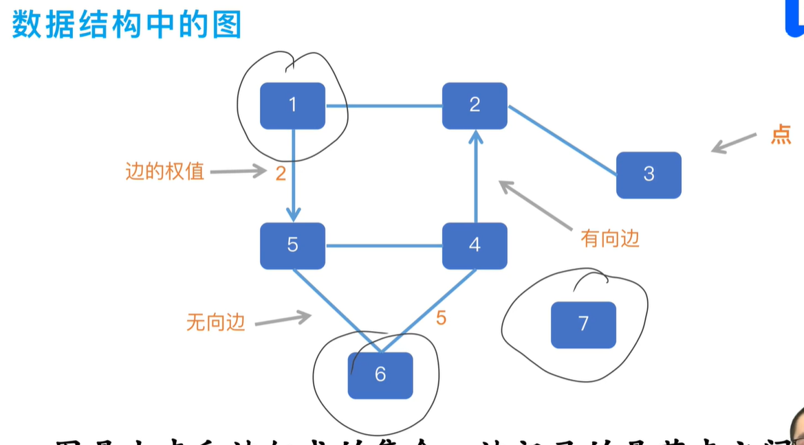
## 图的基本术语
### 1.节点，边（弧） 
### 2.有向边，无向边，有向图，无向图，完全图（从任意点到任意点都有边）；子图（从图中选出一些点和边）
### 3.度（与点相连的边的数量），入度（几条边以他为终点），出度（几条边以他为起点）
### 4.路径，回路（有向图）
### 5.连通图（无向图，从任意点到任意点都有路径），强连通图（有向图），连通分量（无向图，极大连通子图），强连通分量（有向图，....）
### 6.权值（边的权值），带权图。
## 图的存储
### 邻接矩阵
邻接矩阵是一个多维数组，存储节点间边的关系；设图的邻接矩阵为A，An的元素An[i][j]等于由顶点i到顶点j的长度为n的路径数目。
#### 存无向无权图
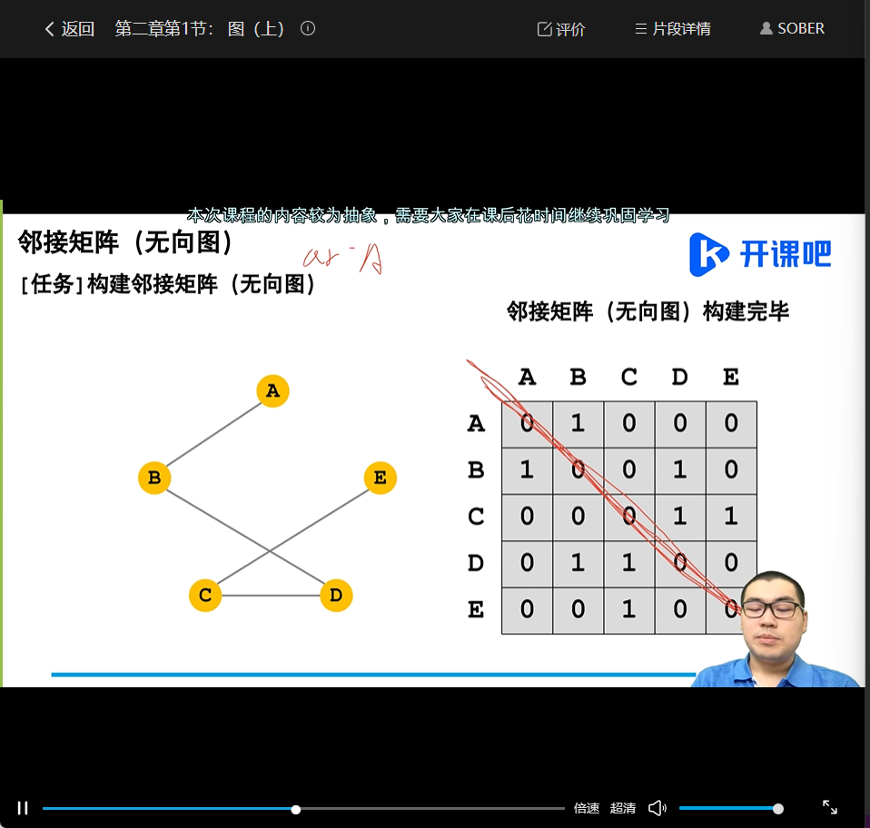
#### 存无向有权图
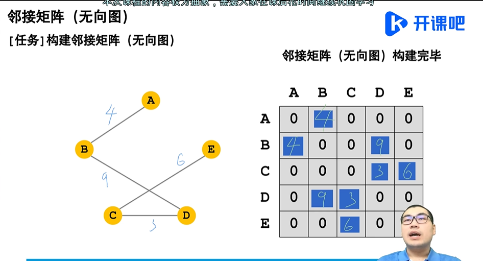
#### 有向图
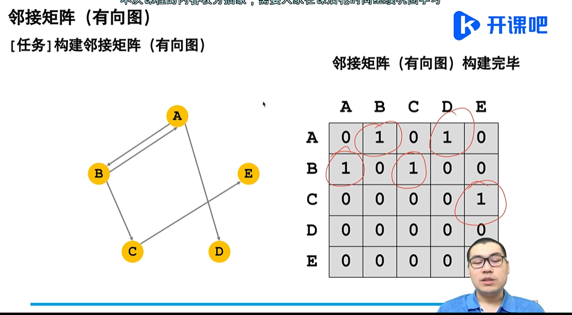
#### 邻接矩阵的优缺点
##### 优点
简单、直观，快速判断两点之间是否偶边
##### 缺点
浪费空间，不能快速访问与某点有关联的边，只能遍历
### 邻接表（链表）
邻接表存储了与每个节点有关的所有边与同一个节点有关的边都存到同一个链表。
#### 存无向图
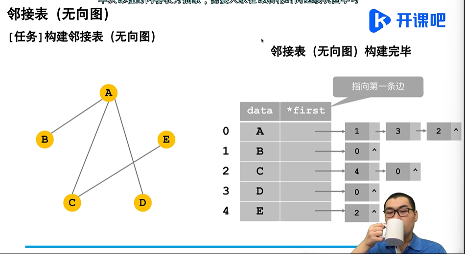
#### 存有向图
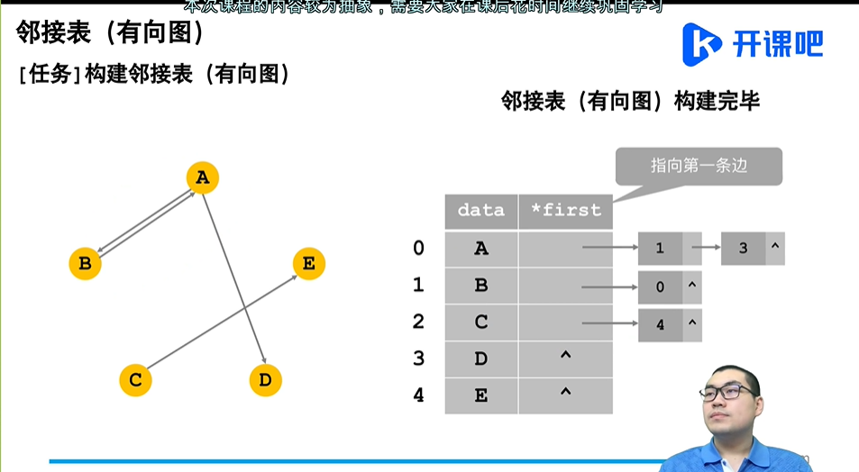
#### 邻接表的优缺点
##### 优点
节省空间、快速访问与某点有关的边
##### 缺点
不直观、不能快速去判断某两点之间的关系 
## 图的遍历
### 深度优先遍历
从起点出发，每次走到一个新的点时就以新的点为起点继续向下走，当走到不能走时，再进行回溯，深度优先遍历一般使用递归实现。
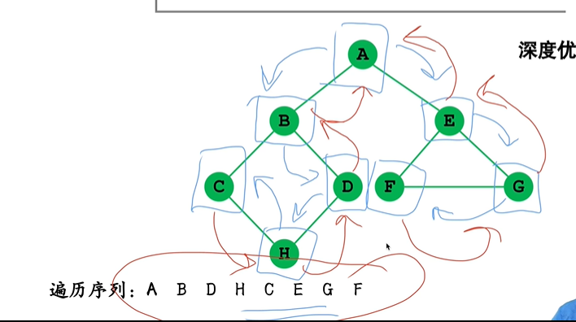
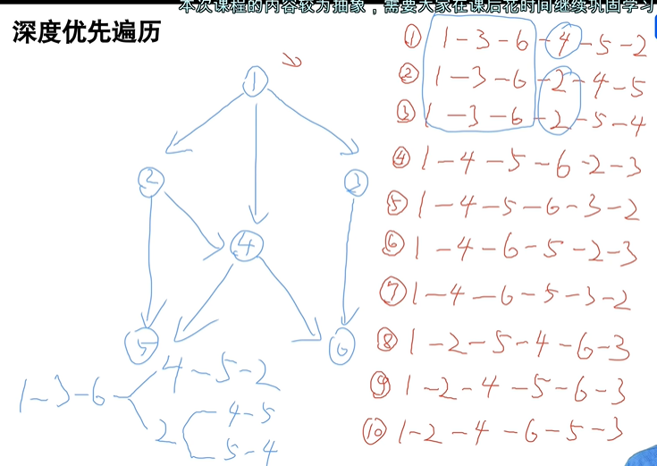
### 广度优先遍历
 从起点出发，先遍历所有连通的点，接下来按照遍历的顺序，继续遍历每个点相连通的点，广度优先遍历一般使用队列实现
 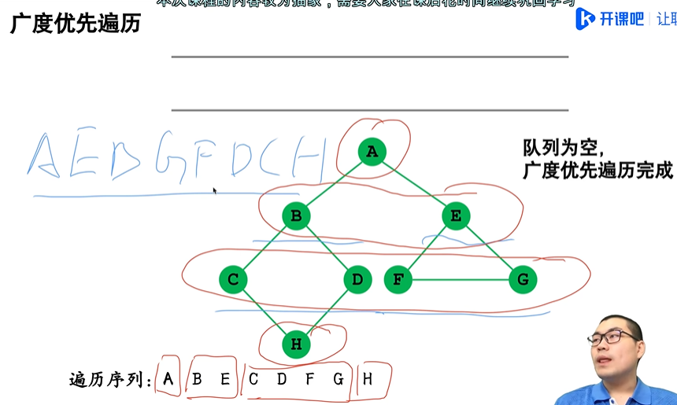
 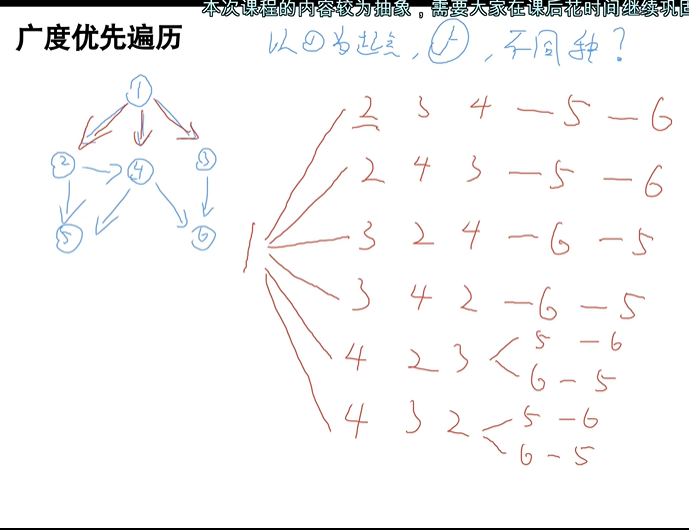
 ## 图的应用（算法）
 ### 最小生成树
 对于一个图来说，删掉一些边，使得每两个节点之间只有一条路径。那么，删掉边以后，可以等到一颗树，这棵树就叫做改图的生成树。所有生成树中，所有边权相加后，总权值最小的生成树，叫做最小生成树。
 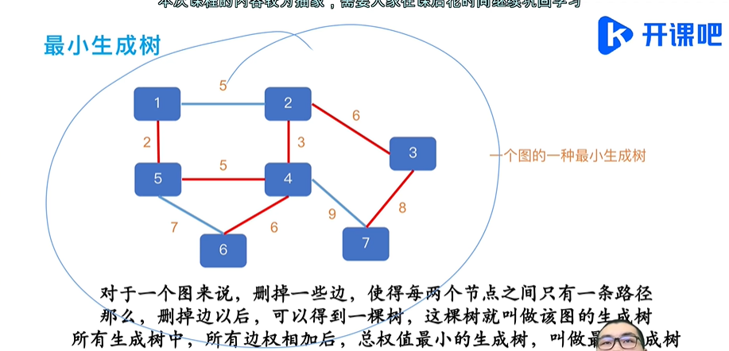
 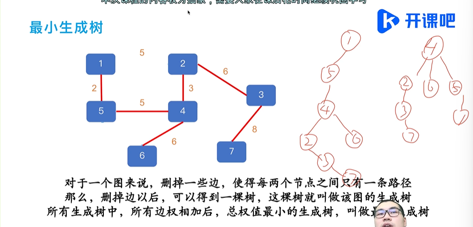
 #### 最小生成树的性质
 ##### 1.若图中有N个节点，那么生成树中应该有N-1条边
 ##### 2.最小生成树的权值总和唯一，但是最小生成树不一定唯一
 #### 最小生成树的求解方法
 ##### Prim算法(以点为基准)
 选择起点--》从所有向外部连接的边中，选择一条权值最短的--》将这条边所连接的点加入内部--》加入后，多了一些外部边，少了一些内部边--》继续这个过程，直到所有点均已连通
 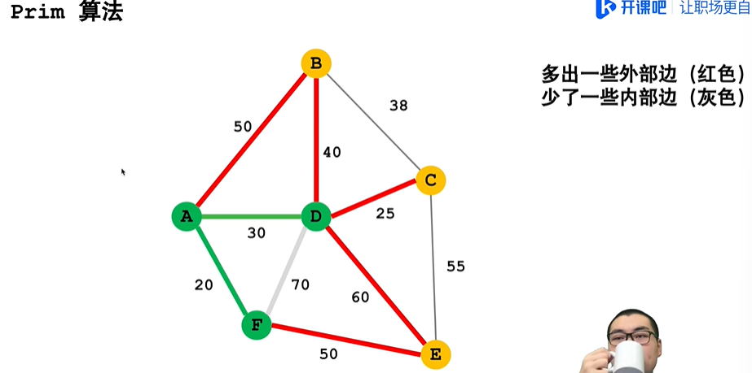
 ##### Kruskal算法(以边为基准)
 并查集==》树形结构，查询两个点是否属于同一个集合（1.合并2.查询）
 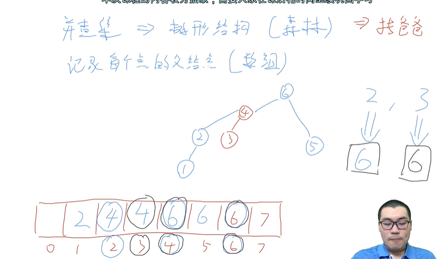
 1.初始化并查集，将所有边按照权值排序--》2.按照权值从小到大，依次遍历所有的边--》3.遍历一条边时，判断这条边的两个端点是否相连（并查集）--》4.若相连，则这条边不是最小生成树中的一条边--》5.若不相连，则这条边是最小生成树中的一条边，连通这两点--》6.继续这个过程，直到所有点均已连通
 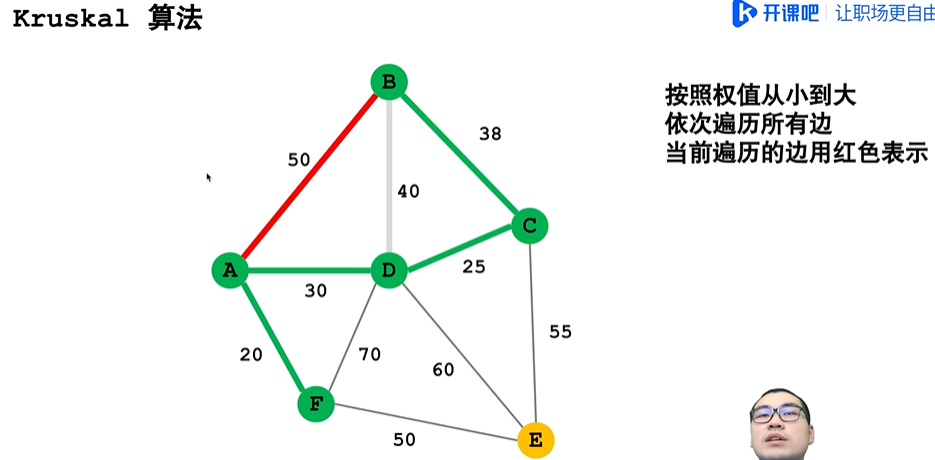
 ### 最短路径
 对于从节点A到节点B的所有路径，总权值最小的路径称之为从A到B的最短路径，简称最短路。最短路也不一定唯一，但是最短权值唯一。
 #### 最短路径的求解方法
 ##### 1.Dijkstra算法（单源最短路径）（不能有负权边）
 1.将所有点的答案改为无穷，确定起点，更新起点的答案为0--》2.在所有有答案且答案未被确定的点当中，选择答案最小的--》3.将该点的答案确定--》4.遍历以该点为起点的所有边，更新边终点的答案--》5.继续这个过程，直到所有点的答案均已确定
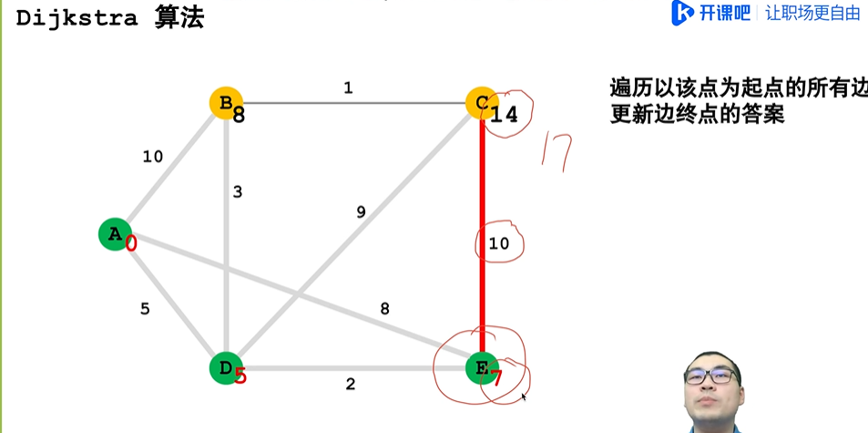
 ##### 2.Floyd算法（多源最短路）
 for(i=1;i<=n>;i++)   -->i是中转点
    for(j=1;j<=n;j++)  -->j是起点
        for(k=1;k<=n;k++)  -->k是终点
            ans[j][k]=min(ans[j][k],ans[j][i]+ans[i][k])
### AOV网
用有向图表示一个工程，其节点表示活动。有向边1->5表示：1活动必须先于 5活动这样一种关系；则称这个图为AOV网（顶点表示活动的网络）
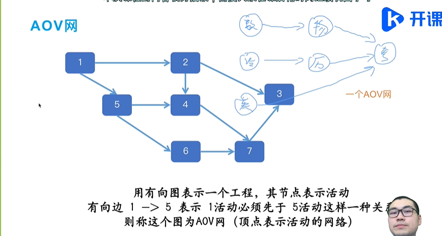
#### 拓扑排序
对于AOV网来说，找到所有活动的一种排序，使得按照排序序列进行活动时，不违反网中活动先后顺序；在求解过程中通常使用入度计数来实现。（入度减1）
#### AOE网与关键路径
用有向图表示一个工程，其边表示活动，有向边1->5 的权值3表示该活动的开销（通常为活动所需时） 。
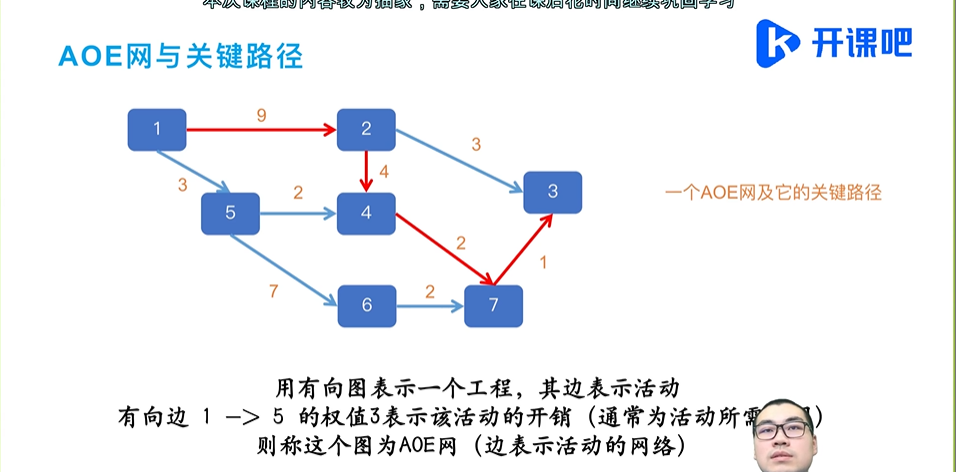
关键路径：从源点到汇点的最长路径
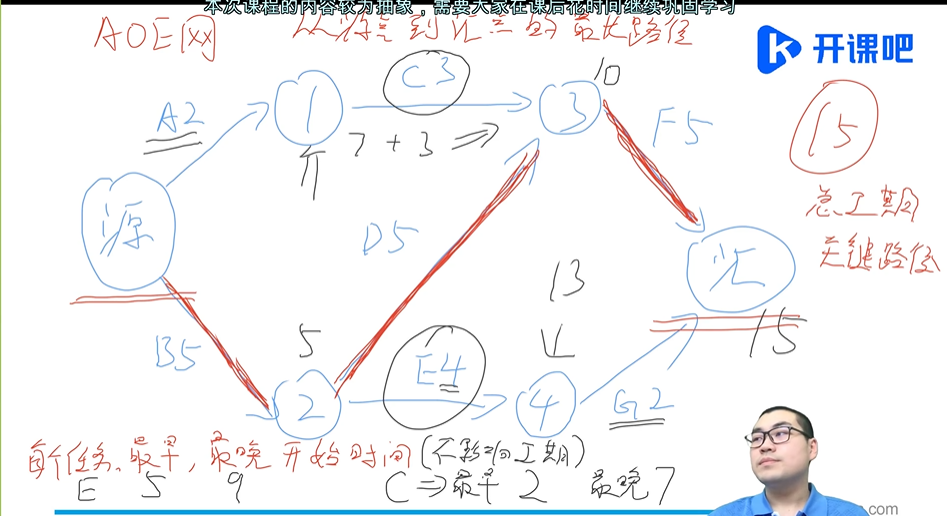
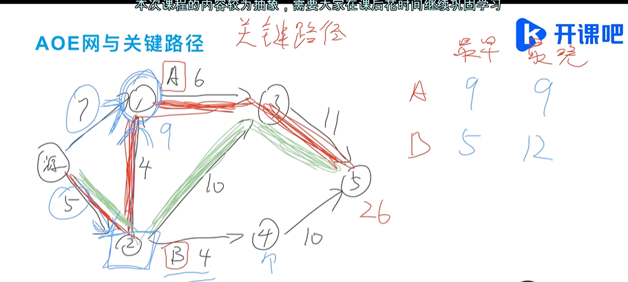
# 总结
## 1.时间/空间复杂度
## 2.线性表 ==》顺序表，链表
## 3.栈，队列
## 4.树形结构，树，二叉树，森林
## 5.排序，插入，交换，选择，归并，基数
## 6.查找，顺序（二分），树形（），哈希表
## 7.图，遍历，存储。。。。